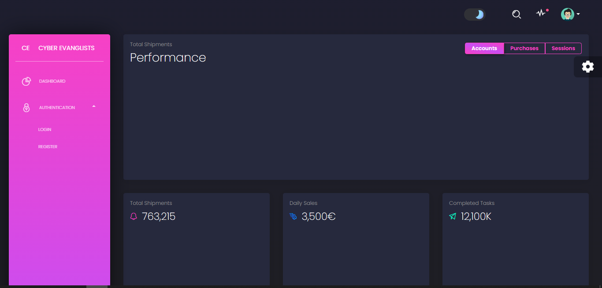
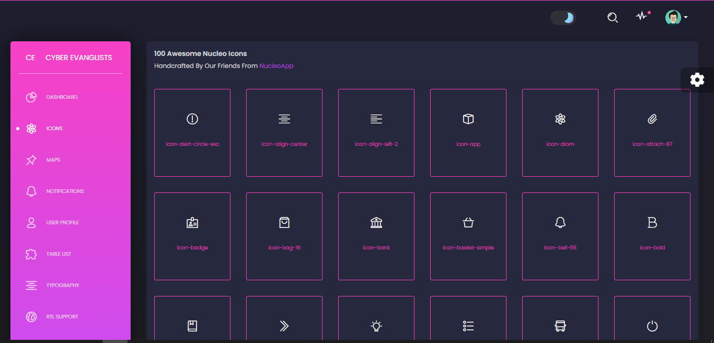
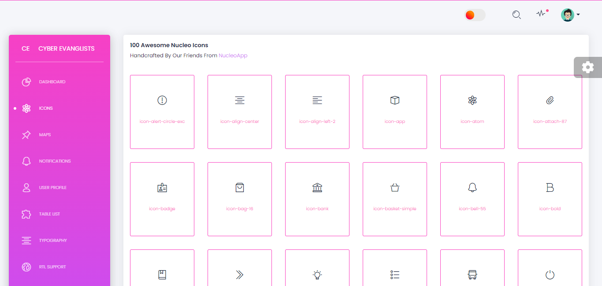
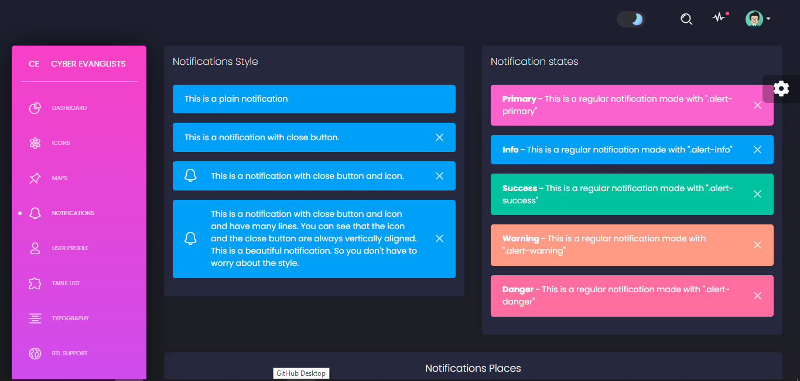
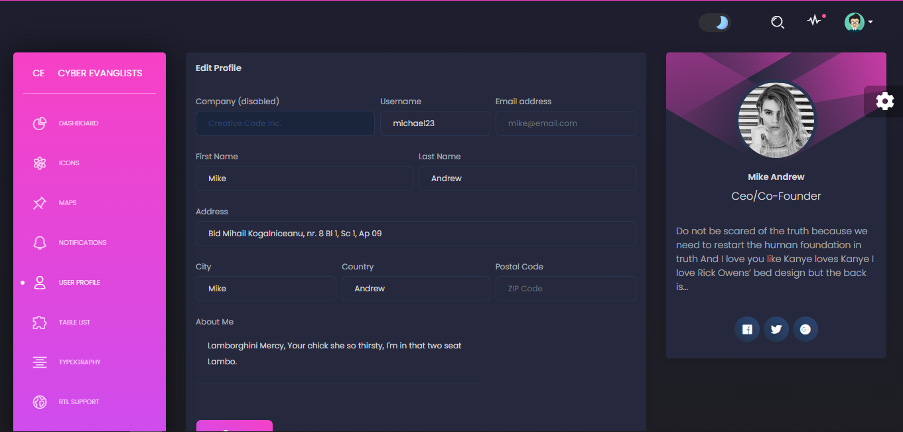
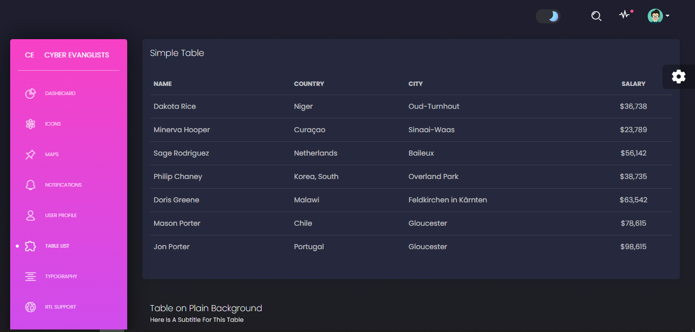

# Django MVT Project with User Functionality and Dashboard

This is a Django project following the Model-View-Template (MVT) architectural pattern. It includes user functionality, allowing users to register, log in, and perform various actions based on their roles. Additionally, it features an administrative dashboard for managing the application.

## Features

- User Registration: Users can create new accounts.
- User Authentication: Users can log in and log out.
- User Roles: Users have different roles (e.g., regular users and administrators) with different permissions.
- Profile Management: Users can update their profiles.
- Secure Authentication: Authentication is implemented securely using Django's built-in features.
- Administrative Dashboard: Administrators can access the dashboard to manage users and application data.
- Sample App: A sample Django app is included to demonstrate user functionality.

## Prerequisites

Before running this project, ensure that you have the following installed:

- Python (3.x recommended)
- Django (3.x recommended)
- sqlite3 or another database of your choice

## Installation

1. Clone the repository.
2. install requiements by command ```pip install -r requirements.txt ``` in your environment.
3. run command ```python manage.py runserver``` in project directory.
4. go to the link ``http://localhost:8000``

### Sample









